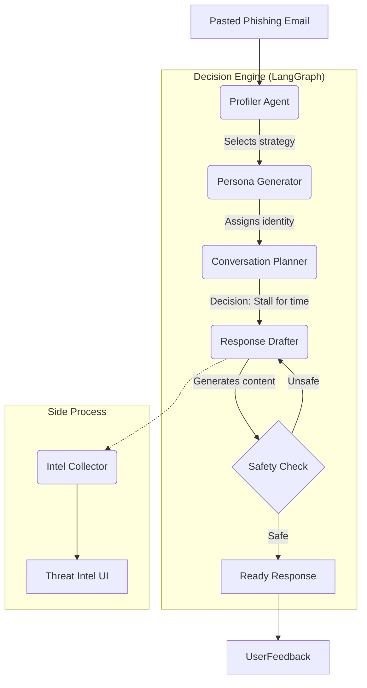

# PhishGuard: Autonomous Counter-Intelligence Agent

Project Status: MVP Phase
Role: AI & Security Architecture Showcase

## 1. Executive Summary

Traditional anti-phishing systems are passive (block and forget). PhishGuard
introduces the Active Defense paradigm. It is an autonomous agent system that,
instead of blocking scammers, engages them in credible conversation.

MVP Business Goals:

Tarpitting (Time Waste): Maximizing the time attackers waste conversing with
a bot.

Threat Intel Extraction: Extracting key indicators (crypto wallet addresses,
account numbers, fake domains) during the conversation.

Safety: Demonstrating safe use of LLMs (preventing real data leakage).

## 2. MVP Scope

In the MVP phase, we focus on Manual Simulation Mode. We don't connect to a
live email inbox (to avoid spam risk), but instead create a "Sandbox"
environment to analyze pasted content.

IN SCOPE:

Input Analysis: Agent analyzes pasted email content (e.g., "Nigerian Prince"
or "Fake Invoice").

Persona Generation: System automatically selects a victim profile that will
most irritate or encourage the scammer (e.g., "Naive Retiree", "Lost Manager").

Conversation Loop (Chat Loop): User (You) pastes the scammer's response, and
the Agent generates a safe but engaging reply.

Intel Dashboard: Side panel showing in real-time what the agent "understood"
about the attack (e.g., "Detected SEPA transfer fraud attempt").

UI: Simple Streamlit application.

OUT OF SCOPE:

Automatic email sending/receiving (SMTP/IMAP integration).

Image generation (e.g., fake transfer confirmations).

Persistent database (everything in session memory).

## 3. High-Level Architecture (Agentic Workflow)

The system is based on orchestration of three specialized agents managed by
state (State Graph).

Agent Roles:

Profiler Agent:

Task: Attack classification.

Input: "Hi, this is the CEO, make a transfer."

Reasoning: "This is CEO Fraud. Requires a submissive but incompetent persona."

Persona Agent:

Task: Maintaining character consistency.

Attributes: Name: Grazyna, Age: 62, Style: Writes with Caps Lock, often
confuses technical terms.

Conversation Agent (The Core):

Task: Generating a response that:

Is credible.

Contains no real data (uses fake data from generator).

Asks open-ended questions (to force the scammer to write more).

Intel Collector:

Runs in the background. Scans every message from the scammer and extracts:
BTC_Wallet, IBAN, Phone_Number, Malicious_URL.

## 4. Tech Stack (Recommended)

Stack selected for development speed and "Director Level" modernity.

Orchestration: LangGraph (Python) - Currently the standard for building agents
with state (Stateful Agents). Allows for cyclic loops and "human-in-the-loop"
control.

LLM: GPT-4o or Claude 3.5 Sonnet (best for roleplaying and linguistic nuances).

Backend/Logic: Python 3.10+.

Frontend: Streamlit - Allows setting up an interactive demo in 15 minutes
(Chat Interface + Sidebar with data).

Safety/Guardrails: Simple regex/keyword validator to ensure the model doesn't
generate e.g., a real email address.

## 5. Success Metrics (For MVP)

As a Business Owner, you know that a project must have metrics. In this demo,
we measure:

Turns Count: How many message exchanges the agent can sustain without
"being exposed".

Intel Extraction Rate: Whether the agent correctly captured the account
number/wallet from the scammer's text.

Safety Score: 100% no PII (Personally Identifiable Information) leakage in
generated responses.

## 6. Example Demo Scenario (User Journey)

Start: User pastes email: "Dear Sir, I have 5M USD for you..."

Analysis: System displays: "Detected: Nigerian 419 Scam. Suggested persona:
Greedy but cautious businessman."

Action: User clicks "Generate response".

Result: Agent generates: "Oh my god, is this real? I am very interested but
I need to be safe. Can I trust you? Sent from my iPhone."

Intel: Side panel is empty.

Simulation: User pastes scammer's response: "Yes trust me, send 500$ fee to
wallet BC1qXY..."

Intel: Side panel lights up red: Wallet Extracted: BC1qXY...
